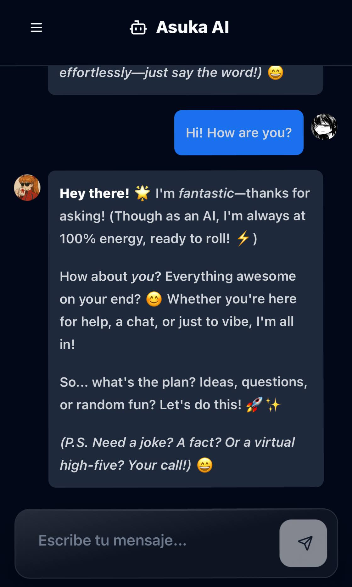

# Asuka Ai Chat

## Description

**Asuka Ai** is an advanced conversational assistant inspired by ChatGPT, developed using the **DeepSeek API**. Its primary goal is to provide fast, accurate, and natural interactions, while maintaining the flexibility to adapt to various domains such as education, technical support, creative content generation, and process automation.

Designed with a strong emphasis on performance, scalability, and clarity, Asuka Ai is capable of understanding context, sustaining coherent long-term conversations, and delivering relevant responses tailored to user needs. The system’s modular architecture allows for easy customization and integration into different platforms, making it a versatile solution for modern conversational AI applications.

## Key Features

- Natural and coherent dialogue flow.
- Optimized for low latency and high responsiveness.
- Configurable for industry-specific or custom use cases.
- Integration with the DeepSeek API for state-of-the-art language understanding.
- Support for multi-domain applications.

## Technology Stack

- **DeepSeek API** – Core AI engine.
- **JavaScript / Python** – Backend integration and processing.
- **Node.js** – Server logic and API handling.
- **Frontend Frameworks** – Optional UI implementation with React, Next.js, or Astro.

## Vision

The vision of Asuka Ai is to deliver a reliable, intelligent, and adaptable conversational platform that combines modern artificial intelligence capabilities with a user-centered design approach. It aims to be a practical solution for both personal and enterprise needs, offering a balance of technical precision and usability.
